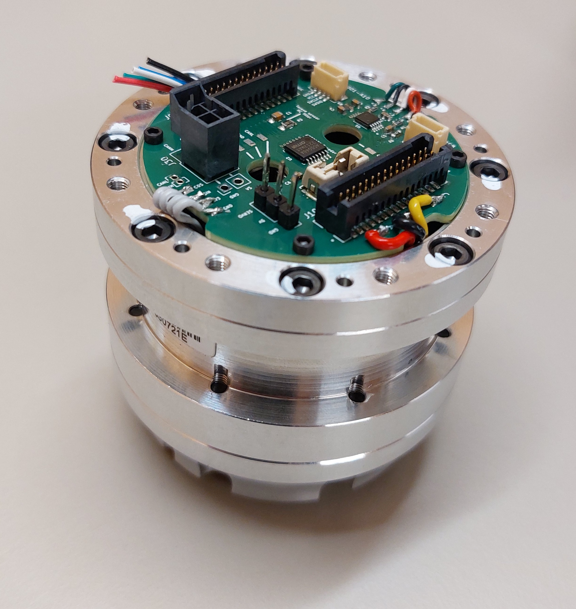

.. _conditioner_gauges:

#################
Gauge conditioner
#################

===============
Getting Started
===============

Download the software

===============================
Configure the Gauge conditioner
===============================

Take an actuator with a carrier board.

Start the PGA308EVM Software

Go to ``PGA308 Controls`` and ``Load RAM with cotents of file``, choose the file ...

Tick the ``Run out of RAM`` and then ``Write to RAM`` 

Click now on ``Read``, Look at the value above the button, and it should be around 1.65V, to correct it, change the ``Coarse offset`` first and then the ``Fine Offset``. After every change, write and read the configuration again.

Once it is done, go to the ``Graph`` tab and click on ``Start Graph`` and apply a torsin on the motor clutch, you should see the value on the graph evolve, now click on ``Stop Graph``.

Go to the ``Registers in OTP`` tab, click on ``Program OTP and POR in One Step`` then click on ``OK``.

To check if everything works fine, unplug and plug back the JST connector on the actuator. ``Read the RAM``, go to ``Graph`` again and see if the value change like before.

The gauges conditioner is now configured.