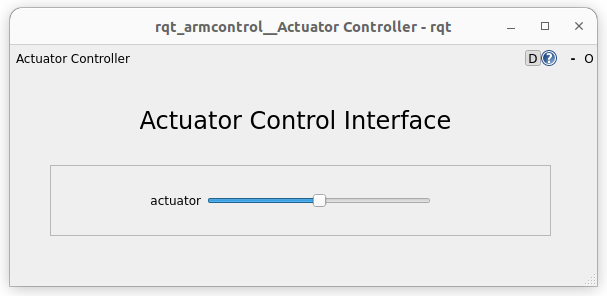
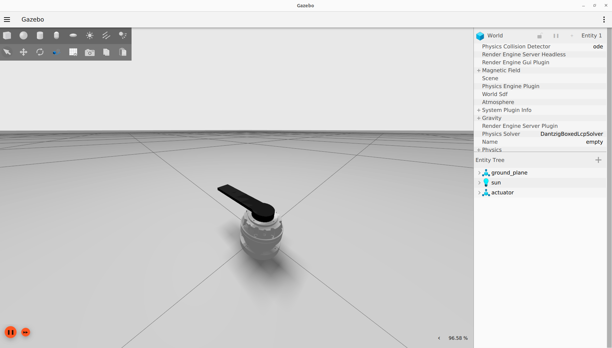

.. _actuator:

########
Actuator
########

================================
Simulation using Gazebo Fortress
================================

To launch the simulation in Gazebo, launch the ``simu_actuator.launch.py`` file from the ``ros2_control_actuator`` package.

.. code-block:: console

    ros2 launch ros2_control_actuator simu_actuator.launch.py 

This script launches RViz, Gazebo, the robot controller, and all necessary files to send commands to the controller.

.. tip:: 

    If you don't want to launch RVIZ, add ``gui:=false`` when launching the simulation

To control the actuator, you can use the GUI 

, or the ``RB`` and ``LB`` triggers of an xbox one controller.

=========================
Use an actuator with VESC
=========================

.. code-block:: console

    sudo ./setcan0_1M.sh

This script configures the can0 interface with a bitrate of 1 Mbps and sets the queue length to 100 packets.

Before lauching anything, go change the ``vesc_joints_can_ids`` parameter with the VESC can ids of your actuator. This parameter is in the config file ``actuator_vesc_hw.yaml`` of the ``ros2_control_explorer`` package.

Position control
-----------------

In the container, launch the ``real_actuator.launch.py`` file from the ``ros2_control_actuator`` package to start the robot controller and RVIZ.

.. code-block:: console

    ros2 launch ros2_control_actuator real_actuator.launch.py can_port:='can0'

.. tip:: 

    If you don't want to launch RVIZ, add ``gui:=false`` when launching the simulation

To control the actuator, you can use the GUI 

, or the ``RB`` and ``LB`` triggers of an xbox one controller.

Velocity control
-----------------

In the container, launch the ``real_actuator.launch.py`` file from the ``ros2_control_actuator`` package to start the robot controller and RVIZ.

.. code-block:: console

    ros2 launch ros2_control_actuator real_actuator_velocity.launch.py can_port:='can0'

.. tip:: 

    If you don't want to launch RVIZ, add ``gui:=false`` when launching the simulation

Torque control
-----------------

In the container, launch the ``real_actuator.launch.py`` file from the ``ros2_control_actuator`` package to start the robot controller and RVIZ.

.. code-block:: console

    ros2 launch ros2_control_actuator real_actuator_torque.launch.py can_port:='can0'

.. tip:: 

    If you don't want to launch RVIZ, add ``gui:=false`` when launching the simulation

