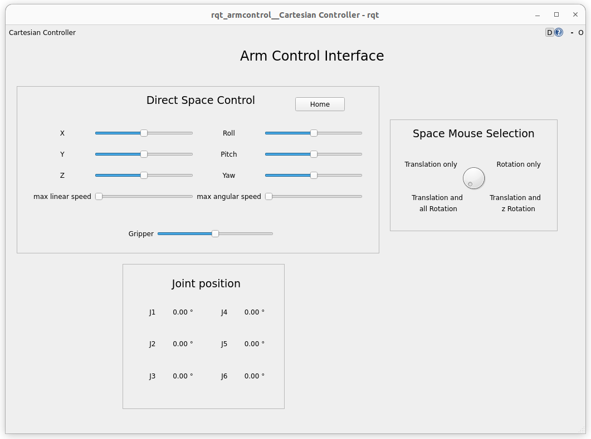

.. _explorer-on-wheelchair:

######################
Explorer on wheelchair
######################

==========
View robot
==========

To view the robot, open a terminal and launch the ``view_explorer_on_wheelchair.launch.py`` file from the ``explorer_on_wheelchair`` package.

.. code-block:: console

    ros2 launch explorer_on_wheelchair view_explorer_on_wheelchair.launch.pIn the 

In the field ``Fixed Frame`` change ``odom`` by ``chassis`` to see the Explorer on the wheelchair

With the ``joint_state_publisher_gui`` you can now change the position of every joint.

================================
Simulation using Gazebo Fortress
================================

Cartesian control
-----------------

To launch the simulation using Gazebo with cartesian control, launch the ``simulation.launch.py`` file from the ``explorer_on_wheelchair`` package.

.. code-block:: console

    ros2 launch explorer_on_wheelchair simulation.launch.py

.. tip:: 

    If you don't want to launch RVIZ, add ``gui:=false`` when launching the simulation

.. tip:: 

    If you don't a 3D mouse, add ``spacenav:=false`` when launching the simulation

To control the robot, you can use the GUI : 

or 3D mouse.

And to control the wheelchair and the patient field of view, you can use the joysticks of an xbox one controller.