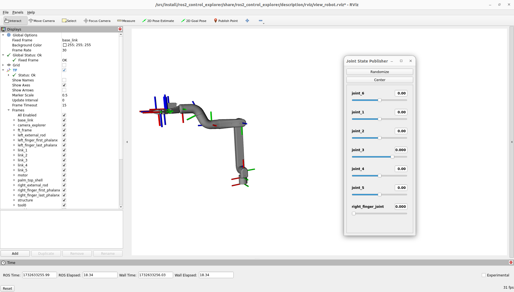
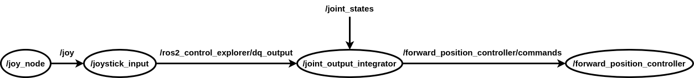
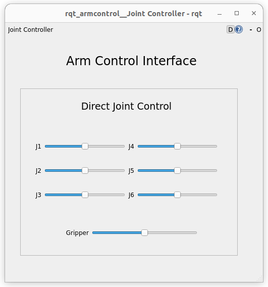
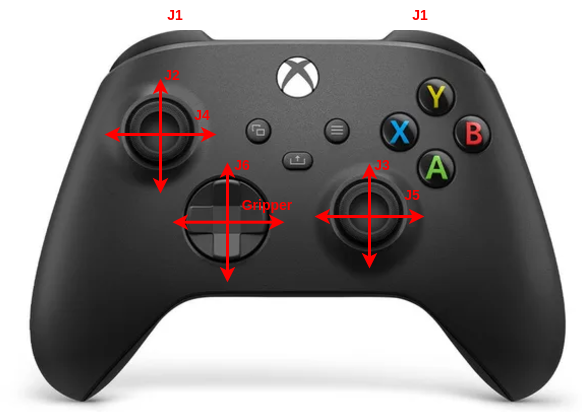

.. _explorer:

########
Explorer
########

==========
View robot
==========

To view the robot, open a terminal and launch the ``view_explorer.launch.py`` file from the ``ros2_control_explorer`` package.

.. code-block:: console

    ros2 launch ros2_control_explorer view_explorer.launch.py

With the ``joint_state_publisher_gui`` you can now change the position of every joint.

================================
Simulation using Gazebo Fortress
================================

Joint control
-------------

To launch the simulation in Gazebo with joint control, launch the ``joint_control.launch.py`` file from the ``ros2_control_explorer`` package.

.. code-block:: console

    ros2 launch ros2_control_explorer joint_control.launch.py

This script launches RViz, Gazebo, the robot controller, and all necessary files to send commands to the controller.

.. tip:: 

    If you don't want to launch RVIZ, add ``gui:=false`` when launching the simulation

To control the robot, you can use the GUI : 

or an Xbox One controller : 

Cartesian control
-----------------

To launch the simulation in Gazebo with cartesian control, launch the ``cartesian_control.launch.py`` file from the ``ros2_control_explorer`` package.

.. code-block:: console

    ros2 launch ros2_control_explorer cartesian_control.launch.py

This script launches RViz, Gazebo, the robot controller, and all necessary files to send commands to the controller.

.. tip:: 

    If you don't want to launch RVIZ, add ``gui:=false`` when launching the simulation

.. tip:: 

    If you don't a 3D mouse, add ``spacenav:=false`` when launching the simulation

To control the robot, you can use the GUI : 

.. image:: Images/GUI_cartesian.png

or 3D mouse. 

================================
Simulation using VESC simulation
================================

Joint control
-------------

To launch the VESC simulator, run the ``app_sim`` file from the ``pyvesc_explorer`` package:

.. code-block:: console

    ros2 run pyvesc_explorer app_sim

In another terminal, launch the ``explorer_joint.launch.py`` file from the ``ros2_control_explorer`` package to start the robot controller and RVIZ:

.. code-block:: console

    ros2 launch ros2_control_explorer explorer_joint.launch.py use_bridge:=true

.. tip:: 

    If you don't want to launch RVIZ, add ``gui:=false`` when launching ``explorer_joint``

To control the robot, you can use the GUI : 

or an Xbox One controller : 

Cartesian control
-----------------

To launch the VESC simulator, run the ``app_sim`` file from the ``pyvesc_explorer`` package:

.. code-block:: console

    ros2 run pyvesc_explorer app_sim

In another terminal, launch the ``explorer_cartesian.launch.py`` file from the ``ros2_control_explorer`` package to start the robot controller and RVIZ:

.. code-block:: console

    ros2 launch ros2_control_explorer explorer_cartesian.launch.py use_bridge:=true

.. tip:: 

    If you don't want to launch RVIZ, add ``gui:=false`` when launching ``explorer_cartesian``

.. tip:: 

    If you don't have a 3D mouse, add ``spacenav:=false`` when launching ``explorer_cartesian``

To control the robot, you can use the GUI : 

.. image:: Images/GUI_cartesian.png

or 3D mouse.

================================
Use the real Explorer
================================

First use of your Explorer
------------------------------

If you are using your Explorer for the first time, go change the ``vesc_joints_can_ids`` parameter with the VESC can ids of your robot. This parameter is in the config file ``explorer_vesc_hw.yaml`` of the ``ros2_control_explorer`` package.

Joint control
-------------

Connect the Explorer power supply and link it to a computer using a USB cable. In the explorer directory in the host run :.

.. code-block:: console

    ./setcan0_500k_host.sh

This script configures the can0 interface with a bitrate of 500 kbps and sets the queue length to 100 packets.

In the container, launch the ``explorer_joint.launch.py`` file from the ``ros2_control_explorer`` package to start the robot controller and RVIZ.

.. code-block:: console

    ros2 launch ros2_control_explorer explorer_joint.launch.py use_bridge:=true

.. tip:: 

    If you don't want to launch RVIZ, add ``gui:=false`` when launching ``explorer_joint``

To control the robot, you can use the GUI : 

or an Xbox One controller : 

Cartesian control
-----------------

Connect the Explorer power supply and link it to a computer using a USB cable. In the explorer directory in the host run :

.. code-block:: console

    ./setcan0_500k_host.sh

This script configures the can0 interface with a bitrate of 500 kbps and sets the queue length to 100 packets.

In the container, launch the ``explorer_cartesian.launch.py`` file from the ``ros2_control_explorer`` package to start the robot controller and RVIZ.

.. code-block:: console

    ros2 launch ros2_control_explorer explorer_cartesian.launch.py use_bridge:=true

.. tip:: 

    If you don't want to launch RVIZ, add ``gui:=false`` when launching ``explorer_cartesian``

.. tip:: 

    If you don't have a 3D mouse, add ``spacenav:=false`` when launching ``explorer_cartesian``

To control the robot, you can use the GUI : 

.. image:: Images/GUI_cartesian.png

or 3D mouse.