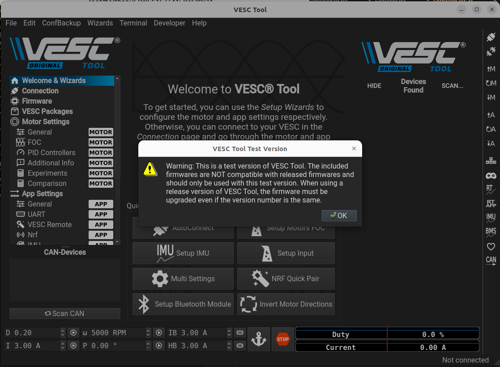
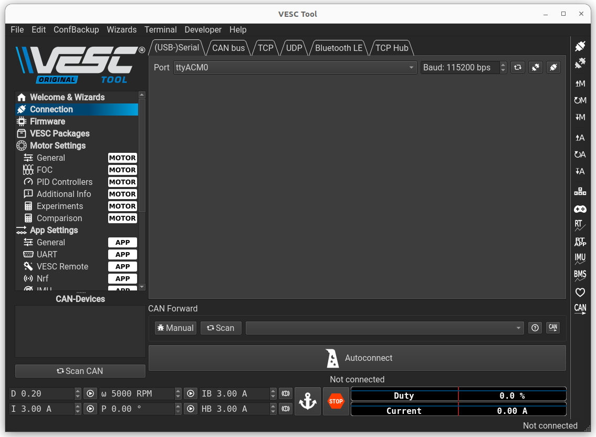
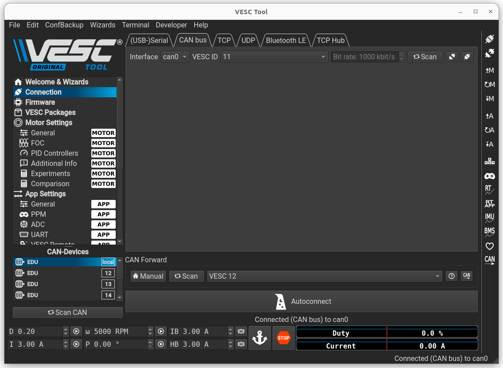
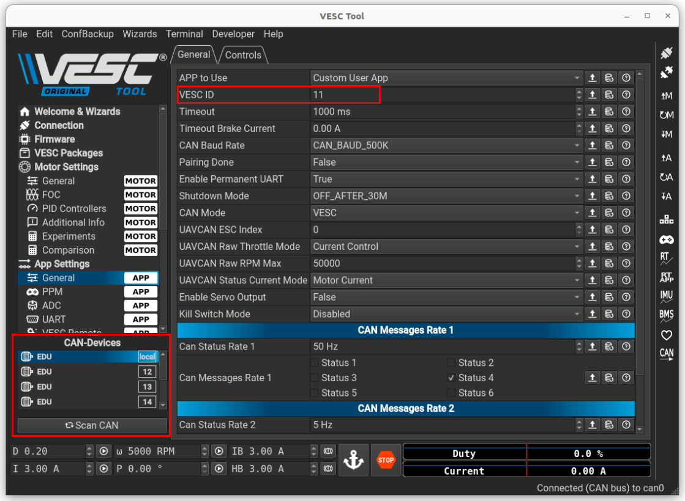
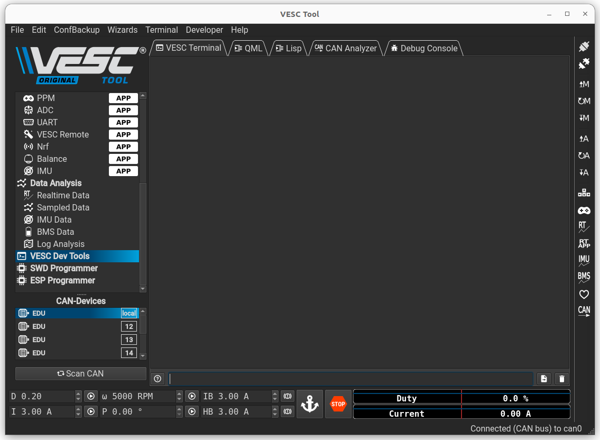

##########
VESC tool
##########

===============
Start VESC tool
===============

Open a terminal in the VESC directory and start a Docker container using the following command: 

.. code-block:: console

    ./docker-run-vesc.sh

Inside the container, run the VESC tool:

.. code-block:: console
    
    ./run_vesc_tool.sh

Click on ``OK`` to begin using the VESC tool.

=================
Connect using USB
=================

To connect to a VESC using USB, start by connecting the VESC borad to your computer using a USB cable. In VESC tool, go to ``Connection``, then under ``(USB-)Serial``, click on the connected plug icon.

If the connection is successful, the following message will appear in the bottom-right corner:  

=================
Connect using CAN
=================

To connect to a VESC using CAN, start by connecting the VESC board to your computer using a USB cable. 

Open a terminal in your VESC directory and run the following command: 

.. code-block:: console

    sudo ./setcan0_500k_host.sh

In VESC Tool, go to ``Connection`` and under ``CAN bus``, click on the ``Scan`` button.
After the scan completes, select the VESC ID of the VESC you want to connect to and click the connected plug button.

If the connection is successful, the following message will appear in the bottom-right corner:

.. _vesc-ID:

==================
Change the CAN ID
==================

To change the CAN ID of a connected VESC, in VESC Tool, go to ``App Settings`` and ``General``, you can now change the ``VESC ID``. 
Save the changes by clicking the A icon with a downward arrow on the right.

You can view the CAN IDs of all VESCs on the CAN bus at the bottom-left corner of the tool.

.. _pos-0:

====================================
Change the position 0 of an actuator
====================================

To change the position 0 of an actuator, once connected, go to ``VESC Dev Tools``.

In ``VESC terminal``:

* To save the current position as the position 0, use the following command : 

.. code-block:: console

    o_offset encoder

* To save the current position as a specific position relative to 0 (in degrees), use the following command:

.. code-block:: console

    o_offset joint (position in degrees)

Save the configuration using this command :

.. code-block:: console

    o_config save